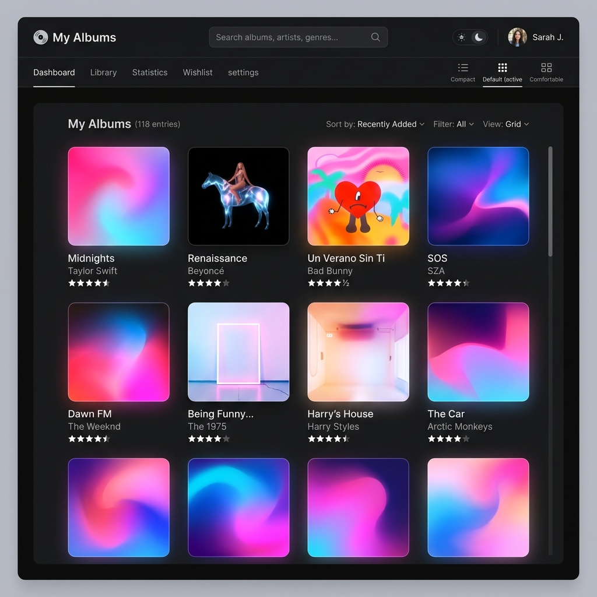
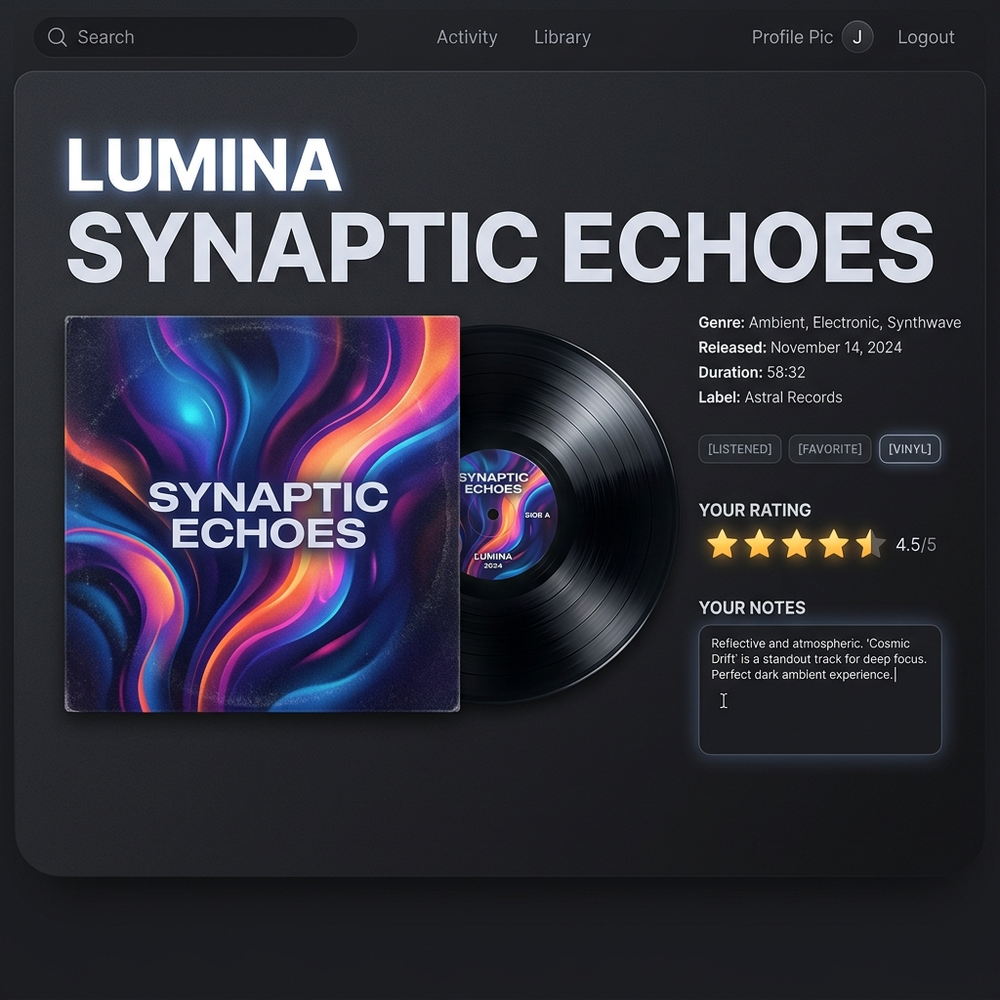

# My Albums

The My Albums web application is designed as a personal tracker for music albums, allowing users to catalog their physical or digital collection, rate tracks, log thoughts, and monitor their progress through want-to-listen queues.

The application is a clean personal music catalog tracker featuring:
- **React Router Navigation:** Manages client-side routing with nested layout wrappers, parameter-driven category grids, single-album profile views, and fallback 404 routing.
- **TanStack Query Synchronization:** Coordinates asynchronous data fetching, localized caching, and automated mutations with cache invalidation rules to trigger instant list refetches.
- **JSON Server Mock Database:** Runs a local RESTful API server powered by `db.json` and `db.seed.json` templates to store tracking logs, ratings, and notes.
- **Theme Mode Customization:** Incorporates a dark/light theme switch that integrates seamlessly with Tailwind utility styles and persists user preferences in `localStorage`.
- **Interactive Reviews:** Supports status tracking (want, active, done, dropped), live star ratings (with hover indicators), and customizable review notes with auto-saving textareas.

It is built using React, Vite, TypeScript, and Tailwind CSS (powered by TanStack Query for state sync, React Router for client-side view management, and json-server for local database storage).

## Setup Instructions

To run this application locally, follow these steps:

### 1. Clone the Repository
```bash
git clone https://github.com/arobertson7/my-albums-csci39548.git
cd my-albums-a4
```

### 2. Install Dependencies
```bash
npm install
```

### 3. Run the Backend & Frontend Servers
The application requires running the local mock backend and the Vite dev server concurrently.

* **Terminal A (Start JSON Mock Server):**
  ```bash
  npm run server
  ```
  *(Launches the json-server watch database on `http://localhost:3001`)*

* **Terminal B (Start Vite Development App):**
  ```bash
  npm run dev
  ```
  *(Launches the development app on `http://localhost:5173`)*

Once both terminals are running, open `http://localhost:5173` in your browser.

### 4. Resetting/Re-seeding the Database (Optional)
If you ever want to discard changes and reset the albums database back to its original seed data, run:
```bash
npm run reset-db
```
*(This replaces the active `db.json` database with the original template from `db.seed.json`)*.

## Screenshots

### Catalog Dashboard (Dark Mode)


### Album Detail & Interactive Crate Reviews

